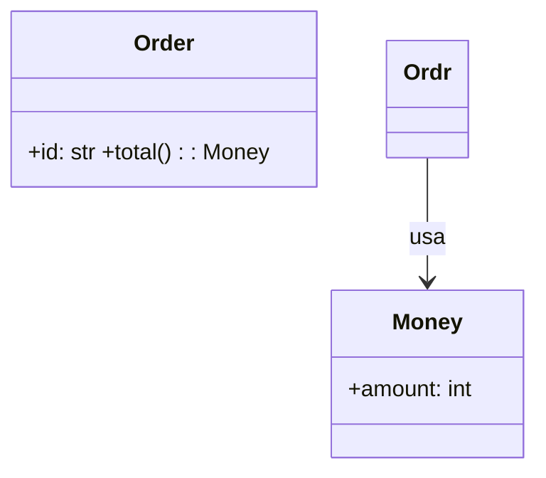

# Mermaid como idioma, y el competidor medido

Investigación de [¿Qué añade esto sobre Mermaid?][15], el ticket que el mapa
declaraba *"la pregunta que manda"*. Su cuerpo daba una instrucción explícita:
*"instala y prueba `claude-mermaid` antes de opinar"*. Esto es eso, hecho.

Sale con una respuesta —**el agente escribe Mermaid**— y con tres premisas del
ticket corregidas por medición: una a favor, dos en contra.

## Nota sobre el método

Todo lo que sigue está **ejecutado** en macOS 25.6 arm64, salvo lo que se marca
explícitamente como *leído y no ejecutado*. Sujetos:

- **`claude-mermaid` 1.6.5** (npm, MIT, autor Vitalii Elenhaupt), el competidor.
- **mmdr 0.3.1**, binario del release `aarch64-apple-darwin` con sha256
  `562d0250…f3223` verificado contra [research 08][r08], y el fuente del tag
  `v0.3.1` para leer su API.

Tokens con `cl100k_base` vía `tiktoken`, el mismo tokenizador de
[research 04][r04] y del comentario de medición del [issue #10][10], para que las
cifras sean comparables. Scripts, fixtures y renders:
[prototipo 18](./prototipos/18-mermaid-frente-al-protocolo/).

## 1. El competidor no es lo que el mapa creía

El ticket lo describía como *"literalmente el producto del handoff, con Mermaid
como lenguaje"*. Corriéndolo, es **el diseño que este mapa abandonó**: servidor
HTTP en el rango `3737-3747`, pestaña del navegador del sistema, WebSocket para
el live reload, CSP propia. Es, casi línea por línea, la superficie de
[La superficie de entrega del visor][7] que el segundo giro mató.

Y sobre todo: **no es efímero, y no lo es a propósito.**

- Los ficheros viven en `~/.config/claude-mermaid/live/<preview_id>/` y **nada los
  borra**.
- `closeLiveServer()` está exportada y **no se llama desde ningún sitio** del
  código — verificado con `grep` sobre todo `build/`.
- Hay galería con buscador, tamaño en KB, *"2 hours ago"* y papelera por
  diagrama; y un `mermaid_save` para exportar a disco.
- Su propio README vende *"Persistent Working Files"* como característica.

Tras quince minutos de uso la galería acumulaba cuatro diagramas, dos de ellos
basura de prueba. **Acumular es la feature**, que es exactamente la decisión
contraria a la del glosario de este proyecto.

Dos cosas más, observadas:

- **Las N vistas no conviven: son N pestañas más una rejilla de tarjetas.** Un
  `preview_id` es una URL es una pestaña. La galería es una rejilla de
  `minmax(280px, 1fr)` con enlaces.
- **No hay estado terminal.** Al morir el proceso la pestaña **sigue enseñando el
  diagrama viejo**: el WebSocket reintenta y se rinde en silencio tras
  `maxReconnectAttempts`. Los dos estados vacíos que [#7][7] declaró obligatorios
  no existen aquí.

## 2. El peaje fijo: la premisa que se cae

El ticket abría con *"es más barato en tokens que nuestro propio protocolo
semántico"*, apoyado en un tool hipotético de 122 tokens. Medido sobre el
`tools/list` real:

| | tokens | reparto |
|---|---:|---|
| `claude-mermaid` 1.6.5, 2 tools | **611** | `mermaid_preview` 417 (desc 101 · schema 299) · `mermaid_save` 190 |
| Flipchart tragando Mermaid, 2 tools | **204** | `show` 129 · `clear` 71 |
| Protocolo propio, 3 tools *([#10][10])* | 738 | desc 89 · schemas 618 |
| Protocolo propio con guía de uso *([#10][10])* | 1.047 | desc 384 · schemas 618 |
| *tldraw, 2 tools ([research 04][r04])* | *~900* | |

**Un MCP de Mermaid real cuesta 611, no 122.** Lo encarecen sus ocho parámetros
de presentación —`theme`, `background`, `width`, `height`, `scale`, `format`—, que
son justo lo que este proyecto no quiere darle al agente.

Con la variante que la pizarra usaría —dos herramientas, sin schema de nodos ni
aristas— el peaje baja a **204**. Con los payloads ya medidos en [#10][10] (`show`
propio 260, retoque 43; `show` Mermaid 151, retoque 151):

```
delta = 643 − 108k      → break-even 6,0 retoques
delta = 952 − 108k      → break-even 8,8 retoques (protocolo con guía de uso)
```

**Hacen falta entre 6 y 9 retoques sobre la misma vista, en la misma
conversación, para amortizar el protocolo propio.** El mapa proyectaba 8-10
contra el hipotético; con el tool real sigue en ese orden.

## 3. La calidad de layout, invertida

El ticket listaba como candidata a respuesta: *"Mermaid decide por ti y su
resultado con clases anidadas es discutible. ¿Es una diferencia que se note, o es
quisquillosidad?"*

Se nota, **y va en nuestra contra.** Mismo `arch.mmd` del [prototipo 13][p13]
—cuatro capas como `subgraph`, ocho nodos, siete aristas cruzándolas—:

- **Mermaid.js** coloca los cuatro grupos sin solaparse
  ([`renders/arch-mermaidjs.png`](./prototipos/18-mermaid-frente-al-protocolo/renders/arch-mermaidjs.png)).
- **mmdr** mete `Infrastructure` entre `API` y `Application`, y saca una arista en
  una U por un hueco vacío
  ([`13-…/renders/arch-subgraphs.png`][p13-arch]).

[research 08][r08] §6 ya lo había dicho —*"las dibuja regular"*, *"lejos de la
calidad de Mermaid.js con dagre"*— y aquí queda con las dos imágenes al lado. **La
contención es la decisión de partida 5**, así que esto no es un fleco: es el eje
del caso protagonista, y nuestra candidata pierde. Es material de
[El stack de rendering][8], no de este ticket, pero sale de aquí.

El precio de ese dibujo mejor, para que la comparación sea justa: 1.827 ms en
frío y ~485 ms en caliente, con 489 MB de `node_modules` y Chromium detrás.
mmdr hace el mismo caso en 62 ms con un fichero de 6,9 MB sin runtime.

## 4. Los paquetes de Rust hacen Mermaid inevitable

La API pública de `mermaid-rs-renderer` 0.3.1:

```rust
render(diagram: &str) -> anyhow::Result<String>
render_strict(input: &str, options: RenderOptions) -> Result<String, ParseError>
parse_mermaid(diagram: &str) -> anyhow::Result<ParseOutput>
parse_mermaid_strict(input: &str) -> Result<ParseOutput, ParseError>
compute_layout(&parsed.graph, &theme, &config) -> Layout
render_svg(&layout, &theme, &config) -> String
```

**Todas las puertas de entrada empiezan por un `&str` de Mermaid.** No hay otra:
`parse_mermaid` es el único productor de un `graph`, `compute_layout` exige ese
`graph`, y [research 08][r08] ya verificó que mmdr no admite posiciones
inyectadas.

De ahí sale la corrección estructural al ticket: **su salida (1) —protocolo
propio— y su salida (3) —Mermaid como primer renderer detrás del protocolo— son
la misma salida.** El ticket las escribió como alternativas porque el renderer
estaba sin elegir; con mmdr, (1) sólo se puede implementar como (3). El texto
Mermaid existe en los dos casos; lo único que decide el ticket es **quién lo
teclea: el modelo, o un serializador nuestro.**

Y con eso el argumento de *"independencia del renderer"* se da la vuelta. Mermaid
lo leen Mermaid.js, mmdr, mermaid-cli, Kroki, GitHub y GitLab en markdown, y el
CLI de Cursor en ASCII. Nuestro JSON semántico lo lee **una** implementación: la
nuestra. Un protocolo propio no compra independencia — la gasta.

## 5. `render_strict`: soportar lo que mmdr soporta, sin lista que mantener

El crate trae lo que el ticket habría tenido que construir:

```rust
pub mod validator;
pub use error::ParseError;   // enum tipado, #[non_exhaustive]
```

`ParseError` no es un string: es un enum con `UnknownParticipant { name, line,
candidates }`, `UnclosedSubgraph { opened_at }`,
`UnexpectedToken { line, col, found, expected }`. Y su propio doc declara para
quién está pensado:

> *"so callers (CMSs, editors, **LLM correction loops**) can classify failures
> and produce actionable diagnostics without scraping error strings."*

**mmdr trae el bucle de corrección del agente de fábrica**: línea, columna y
candidatos de *"quizá querías decir"*, que es lo que un modelo necesita para
arreglarse solo sin que se le devuelva el estado.

Eso convierte *"soportamos lo que mmdr soporta"* en **una llamada a función** en
vez de una lista negra que persiga la evolución de Mermaid. Cuando mmdr crezca,
el soporte crece al subir la versión del crate.

De propina, una corrección a [research 08][r08]: `render_strict` hace
`resolve_options(options, parsed.init_config)`, y `merge_init_config` es público,
así que **por el camino de la librería el `%%{init}%%` sí se resuelve**; el *"se
parsea y no se aplica"* del issue #137 de mmdr es del camino del binario. **Leído,
no ejecutado.**

## 6. Pero mmdr falla abierto, y de la peor manera

`validator::validate` hace seis comprobaciones —JSON del `%%{init}%%`, balance de
`subgraph`/`end`, línea que empieza por flecha, comillas de `click`, participantes
de `sequence`—. **Ninguna es "sentencia desconocida".** Los tres sondeos, todos
con `exit 0`:

**1. Los constructos de píxel se aplican.**

```mermaid
classDef danger fill:#f00,stroke:#900,stroke-width:4px
class A danger
style B fill:#0f0
linkStyle 0 stroke:#00f,stroke-width:6px
```

→ `fill="#f00"`, `fill="#0f0"`, `stroke="#00f"` en el SVG. **La decisión de
partida 5 —*"prohibido expresar HTML, SVG, CSS, coordenadas, tamaños, colores o
formas concretas"*— hoy no la defiende nadie.** El parser vive en `src/parser.rs`,
no en `src/parser/`.

**2. La basura se dibuja.** `esto_no_es_mermaid_en_absoluto {{{ ???` y
`@@@ ni esto` aterrizan como **cajas**. No descarta lo que no entiende: lo pinta.

**3. Y el caso que decidió el ticket — la mentira plausible.**



Dibuja **tres** clases: `Order` con sus miembros, `Money`, y una `Ordr` vacía de
la que sale la relación. Lo que el usuario lee es *"`Order` no tiene relación con
`Money`, y hay otra clase `Ordr` que sí"*. Una caja vacía al lado de una llena no
se lee como un typo: se lee como una clase de la que se sabe menos.

**No es un bug de mmdr: es la auto-creación de ids de Mermaid**, que es diseño del
idioma. Y **Mermaid.js hace lo mismo, y peor: más bonito**
([`renders/typo-mermaidjs.png`](./prototipos/18-mermaid-frente-al-protocolo/renders/typo-mermaidjs.png)).
Renderizada por Mermaid.js, la caja fantasma con sus secciones vacías es
indistinguible de una clase legítima de la que se sabe poco.

Es la enfermedad que mató a termaid —una relación atada a lo que no es— entrando
por la puerta del idioma en vez de por la del renderer. Y es lo que le da al
ticket su respuesta positiva: **lo que la pizarra añade sobre Mermaid es que se
niega a dibujarla.** El `Límite honesto` del glosario, que era de tamaño, se
ensancha al idioma.

## 7. Y el estilo se puede quitar sin perseguir sintaxis

Todo el estilo de Mermaid aterriza en siete campos públicos del `Graph`:

```rust
pub class_defs:         HashMap<String, NodeStyle>,        // classDef
pub node_classes:       HashMap<String, Vec<String>>,      // class A danger / A:::danger
pub node_styles:        HashMap<String, NodeStyle>,        // style A fill:#0f0
pub subgraph_styles:    HashMap<String, NodeStyle>,
pub subgraph_classes:   HashMap<String, Vec<String>>,
pub edge_styles:        HashMap<usize, EdgeStyleOverride>, // linkStyle 0 …
pub edge_style_default: Option<EdgeStyleOverride>,
```

Más `node_links` (el `click` con URL, que además es interacción y está fuera de
alcance) y `parsed.init_config`, que en la API por etapas simplemente no se pasa.
Vaciarlos tras el parse **no persigue la sintaxis de Mermaid**: por muchas formas
nuevas de escribir estilo que Mermaid invente, para tener efecto tienen que
aterrizar en uno de esos campos. El residuo es un campo *nuevo* en una versión
futura, y `Graph` es una struct pública: eso se ve al subir la versión, no se
descubre en producción.

## 8. Riesgos de la decisión

- **Prometemos "Mermaid" y entregamos "el Mermaid de mmdr".** [research 08][r08]
  §8 ya avisaba: es una reimplementación, y pueden divergir en sintaxis de borde.
  Un usuario que pegue un diagrama que le funciona en GitHub puede ver otra cosa.
- **La prohibición de píxeles pasa de imposible a limpiada-y-avisada.** Un schema
  hace imposible lo prohibido; vaciar campos del IR sólo lo neutraliza. Nada
  estructural impide que dentro de tres meses alguien deje de vaciar un campo.
- **Nuestro renderer dibuja los grupos peor que el del competidor** (§3), y la
  contención es el caso protagonista. Va a [El stack de rendering][8].
- **`ParseError` es `#[non_exhaustive]`** y su doc pide brazo comodín o
  actualizar con cada release.
- **La invariante de ids declarados es nuestra, no de mmdr.** `UnknownParticipant`
  existe pero mmdr sólo lo aplica a `sequence`; extenderlo a `classDiagram` y
  `flowchart` es trabajo de la pizarra.

## Fuentes

- `claude-mermaid` 1.6.5 — <https://github.com/veelenga/claude-mermaid>
- `mermaid-rs-renderer` 0.3.1 — <https://github.com/1jehuang/mermaid-rs-renderer>
- Scripts, fixtures y renders: [prototipo 18](./prototipos/18-mermaid-frente-al-protocolo/)
- Casos de grupos reutilizados de [prototipo 13][p13]

[7]: https://github.com/javierponferradalopez/ai-render/issues/7
[8]: https://github.com/javierponferradalopez/ai-render/issues/8
[10]: https://github.com/javierponferradalopez/ai-render/issues/10
[15]: https://github.com/javierponferradalopez/ai-render/issues/15
[r04]: ./04-mcp-de-tldraw.md
[r08]: ./08-mmdr-un-mermaid-que-emite-geometria.md
[p13]: ./prototipos/13-mmdr-frente-a-termaid/
[p13-arch]: ./prototipos/13-mmdr-frente-a-termaid/renders/arch-subgraphs.png
